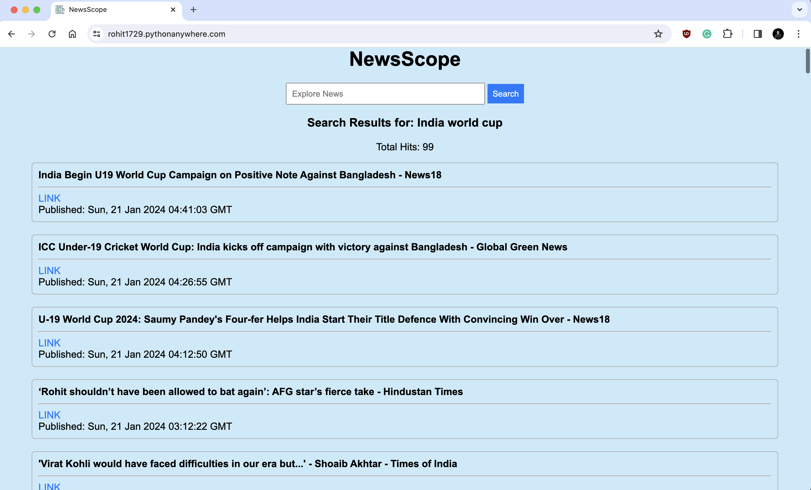

# News-Scope

NewsScope is a dynamic Python Flask project designed to revolutionize your news exploration experience. With a user-friendly interface, the application invites users to input their search queries, unleashing the power of Google RSS search URLs to curate and present news articles specifically related to the entered string. The project seamlessly fetches and filters news from a diverse range of reputable sources, offering a comprehensive view of the latest updates aligned with the user's interests. Hosted for accessibility, NewsScope promises an intuitive and personalized news discovery platform, redefining the way users stay informed in real-time.



# Running

Install necessary python libraries as per _requirements.txt_ file and then run it

```
pip install -r requirements.txt
python3 app.py
```
The news articles presented in "NewsScope" are sourced from Google RSS feeds : https://news.google.com/rss

Disclaimer : "NewsScope" relies on the Google RSS feed for news aggregation, and the content displayed is sourced directly from various news articles available through this feed. The application does not alter or control the content provided by the Google RSS feed. Users are encouraged to visit the respective news websites for the complete and original articles, and the application holds no responsibility for the accuracy or timeliness of the information presented. The usage of the Google RSS feed is subject to Google's terms of service and policies.

Copyright Disclaimer under Section 107 of the Copyright Act of 1976: "NewsScope" acknowledges that the content displayed may include material protected by copyright laws. In accordance with Section 107 of the Copyright Act of 1976, the application is presented for nonprofit educational and informational purposes. The use of copyrighted material in "NewsScope" is considered fair use, as it is intended to provide commentary, news reporting, and information dissemination. If you wish to use copyrighted material from "NewsScope" for purposes that go beyond fair use, you must obtain permission from the copyright owner.
